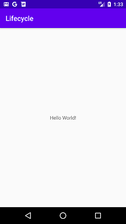

# Activity Lifecycle Example
Projeto desenvolvido no Bootcamp everis Kotlin Developer da [Digital Innovation One](https://digitalinnovation.one).

Trata-se de um aplicativo simples que usa a classe Log para registrar a passagem da Activity pelos métodos do ciclo de vida `onCreate`, `onStart`, `onResume`, `onRestart`, `onPause`, `onStop` e `onDestroy`.

## Instruções
Faça o clone do projeto ou o download do projeto e execute a aplicação no Android Studio.

Clique na guia **Logcat** na parte inferior do Android Studio e use o filtro `I/Lifecycle` para ver os logs do aplicativo.

## Screenshots
